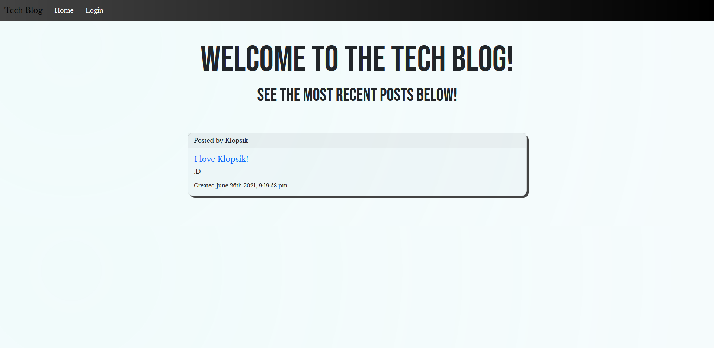
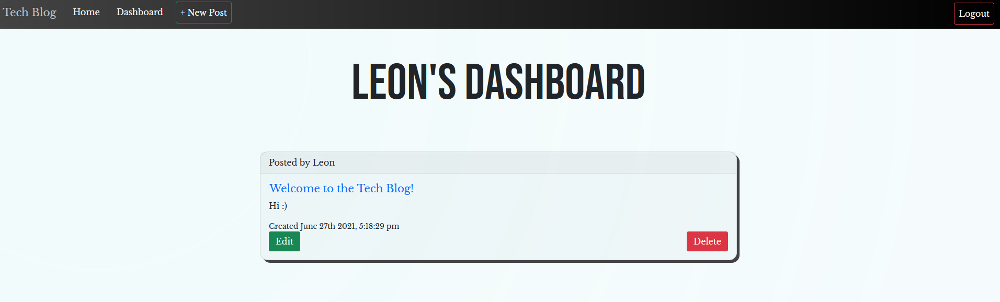
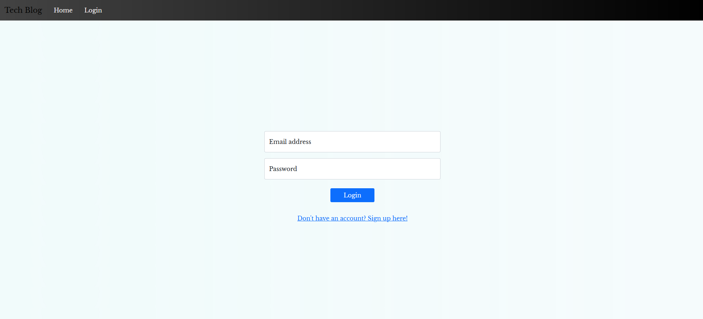

# Tech Blog

## Description

The Tech Blog allows users to log in, create an account that is then securely stored to the database with bcrypt, create posts, update posts, delete posts, and add comments via a graphical interface.

## Table of Contents

- [Tech Blog](#tech-blog)
  - [Description](#description)
  - [Table of Contents](#table-of-contents)
  - [Installation](#installation)
  - [Usage](#usage)
  - [Screenshots](#screenshots)
  - [Tech/framework used](#techframework-used)
  - [Features](#features)
  - [Scripts](#scripts)
  - [Tests](#tests)
  - [Contact](#contact)

## Installation

```
npm install
```

## Usage

Enter your database details into the .env file, run 'npm run seed' to seed the data to your DB (after creating it), and then run 'node index.js' or 'npm run start'.

## Screenshots

Homepage:


Dashboard:


Login:


## Tech/framework used

<b>Built with</b>

- [Node.js](https://nodejs.org/en/)
- [Sequelize](https://sequelize.org/)
- [MYSQL](https://www.mysql.com/)
- [Express](https://expressjs.com/)
- [dotenv](https://www.npmjs.com/package/dotenv)
- [handlebars](https://handlebarsjs.com/)
- [bcrypt](https://www.npmjs.com/package/bcrypt)
- [bootstrap](https://getbootstrap.com/)

## Features

- Login & Signup feature.
- View all blog posts on the homepage.
- Click a blog post to extend it and add/view comments.
- View your blog posts on the dashboard.
- Edit and delete your blog posts from the dashboard.

## Scripts

You can use the below scripts to run the app without or with nodemon:

```
npm run start
npm run dev
```

## Tests

N/A

## Contact

For any issues, please contact [my email](mailto:leonwheeler08@gmail.com) 😀
